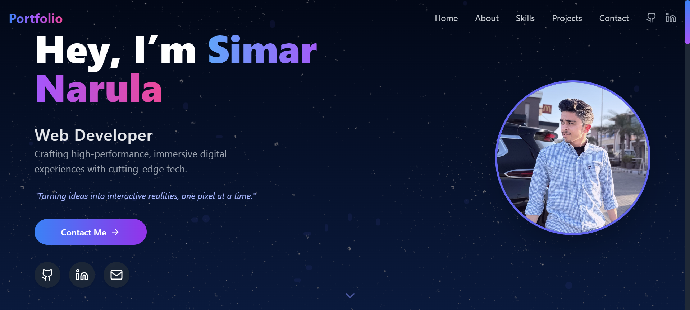
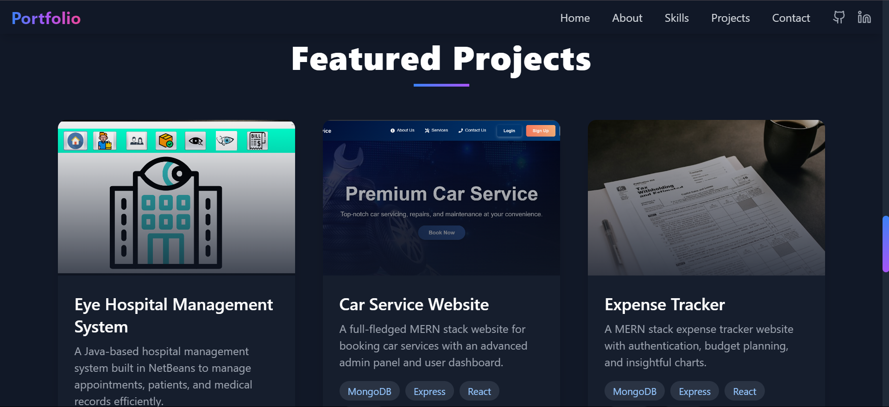

# 💼 Simar's Portfolio

Welcome to my personal portfolio website — a showcase of my skills, projects, and journey as a developer.

🔗 **Live Site:** [https://portfoliosimar.netlify.app](https://portfoliosimar.netlify.app)

---

## 🚀 About the Project

This portfolio is built to highlight my:
- Technical skills in web development
- Projects I’ve worked on
- Education and certifications
- Contact and social links

The design is modern, responsive, and built with performance and simplicity in mind.

---

## 🛠️ Tech Stack

- **Frontend:** React.js, TypeScript
- **Styling:** Tailwind CSS, Framer Motion
- **Deployment:** Netlify

---

## 📸 Screenshots

| Home Page | Projects Page |
|----------|----------------|
|  |  |

> *(You can update the image links based on your folder structure)*

---

## 🧑‍💻 Author

**Simar**  
🔗 [Visit Portfolio](https://portfoliosimar.netlify.app)  
📧 [Email me](mailto:simarnarula1477@gmail.com)  
🐙 [GitHub](https://github.com/simar111)  
🔗 [LinkedIn](www.linkedin.com/in/simarnarula)

---

## 📜 License

This project is licensed under the MIT License — feel free to use, improve, or share with credit.

---

## ⭐ Show Your Support

If you liked this project, don’t forget to:
- ⭐ Star the repo
- 🛠 Suggest improvements
- 📣 Share with others

